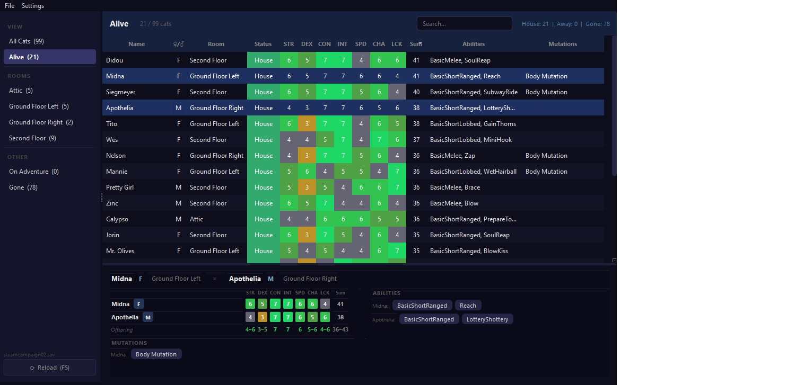

# Mewgenics Breeding Manager

An external breeding and roster manager for [Mewgenics](https://store.steampowered.com/app/686060/Mewgenics/) — similar to Dwarf Therapist for Dwarf Fortress.

Reads your save file live and gives you a clear view of every cat's stats, room, abilities, mutations, and lineage so you can make smarter breeding decisions without alt-tabbing.



## Features

- **Live save reading** — watches the save file and reloads automatically when the game writes
- **Full cat roster** — all cats in one sortable table; filter by room, adventure, or gone
- **Color-coded base stats** — red (1) → grey (4) → green (7) at a glance
- **Detail panel** — click any cat to see abilities, mutations, equipment, and lineage
- **Breeding comparison** — Ctrl+click two cats to see offspring stat ranges, combined mutations, and lineage safety
- **Ancestry / inbreeding guard** — tracks parent and grandparent links; flags shared ancestors or direct parent/offspring pairs before you breed

## Requirements

- Python 3.11+
- [PySide6](https://pypi.org/project/PySide6/)
- [lz4](https://pypi.org/project/lz4/)

## Installation

```bash
git clone https://github.com/frankieg33/MewgenicsBreedingManager
cd MewgenicsBreedingManager
pip install -r requirements.txt
python mewgenics_manager.py
```

Or on Windows, double-click **run.bat** — it installs dependencies automatically on first run.

## Usage

The app auto-detects your save file from:
```
%APPDATA%\Glaiel Games\Mewgenics\<SteamID>\saves\
```

Use **File → Open Save File** to load a different save, or **File → Reload** (F5) to force a refresh.

### Roster table
| Column | Description |
|--------|-------------|
| Name | Cat's name |
| ♀/♂ | Gender |
| Room | Current room in the house |
| Status | `House` / `Away` (adventure) / `Gone` (dead) |
| STR–LCK | Base (heritable) stats, color coded |
| Mutations | Passive mutation traits |

Hover a stat cell to see base vs. total (including equipment bonuses).

### Detail panel
- **1 cat selected** — shows abilities, mutations, equipment, and known lineage (parents + grandparents)
- **2 cats selected (Ctrl+click)** — shows a breeding comparison:
  - Per-stat range (`low–high`) colored by best possible outcome
  - Which parent leads each stat
  - Combined mutations from both parents
  - Lineage safety check (shared ancestor warning or clear)

### Sidebar filters
- **All Cats** — every living cat (house + adventure)
- **Room buttons** — dynamically generated for each occupied room
- **On Adventure** — cats currently in a run
- **Gone** — dead cats

## Notes on ancestry

Parent links are resolved by matching `uniqueId` references stored in the cat blob. Founding cats (imported or from the start of a run) have no parent data and will show **"Lineage unknown"** — this is expected and not an error.

## Credits

Save file parsing based on [pzx521521/mewgenics-save-editor](https://github.com/pzx521521/mewgenics-save-editor) and community research on the Mewgenics save format.
